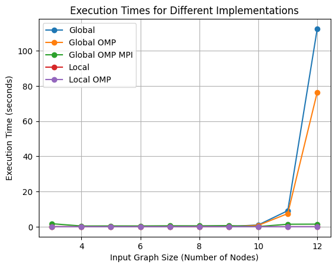

# Vehicle Routing Problem (VRP) - Code Implementations

## Introduction to Vehicle Routing Problem (VRP)

The Vehicle Routing Problem (VRP) is a complex optimization challenge commonly encountered in logistics and transportation planning. The objective is to design the most efficient routes for a fleet of vehicles delivering goods or services to a series of destinations, adhering to specific constraints. These constraints typically include vehicle capacity, maximum travel distance, or number of stops per route. Effective solutions to the VRP are essential for reducing operational costs and enhancing logistical efficiency.

## Implementation Details

### 1. Global Search Implementation

The global search implementation methodically generates and evaluates all permutations of routes to determine the most effective routes that adhere to specific constraints, such as maximum weight and number of stops. The evaluation process unfolds as follows:

* **Route Simulation** : Each permutation is simulated as a potential delivery route. The simulation iterates through each permutation, checking each step to see if adding the next stop would exceed the vehicle's capacity or violate other constraints.
* **Constraint Violation and Correction** : If a constraint is violated, the algorithm attempts to rectify the route by inserting a return trip to the depot ('0'). This action resets the vehicle's load, allowing the continuation of the route without violating constraints.
* **Route Validation** : If it's not feasible to return to the depot or continue from the depot to the next stop (due to a lack of direct routes), the route is deemed invalid and discarded.

Although this brute-force method ensures that all potential routes are considered, it is computationally demanding and becomes impractical as the number of stops increases.

### 2. Global Search with OpenMP (OMP)

This implementation enhances the basic global search by incorporating parallel processing using OpenMP, which improves efficiency and reduces execution time. The parallel implementation is structured as follows:

* **Parallel Processing** : The workload of evaluating route permutations is distributed among multiple threads, allowing simultaneous processing.
* **Route Evaluation and Correction** : Similar to the single-threaded approach, each thread evaluates a subset of routes, checking for and correcting constraint violations by potentially inserting a return to the depot.
* **Synchronization** : Access to shared resources, like the list of valid routes, is synchronized across threads to prevent data corruption and ensure accurate results.

This method leverages multicore processors to significantly expedite the evaluation process, although scalability can still be a challenge with very large datasets.

### 3. Global Search with MPI and OpenMP

This sophisticated implementation combines MPI (Message Passing Interface) and OpenMP to utilize both distributed and shared memory architectures, optimizing for execution across multiple computational nodes. The process involves:

* **Distributed Computing** : Permutations of routes are divided and distributed among different nodes using MPI, effectively sharing the computational load.
* **Parallel Route Evaluation** : Within each node, OpenMP is used to parallelize the processing of each subset of permutations further.
* **Route Correction and Validation** : Each thread examines route validity, attempting to rectify violations by inserting returns to the depot when necessary. Routes that cannot be fixed are discarded.
* **Result Compilation** : After processing, the results from all nodes are collected, and the most cost-effective route is identified and selected on the root node.

This hybrid approach is highly scalable and capable of efficiently handling extremely large problems by distributing the computational load across multiple nodes, making it ideal for industrial-scale applications.

### 4. Local Search Implementation using Nearest Insertion

The local search implementation employs a heuristic approach known as "nearest insertion" to construct a route. This method is less computationally intensive compared to global search and focuses on building a feasible route incrementally. Here’s how it operates:

- **Initialization**: Start from the depot (represented as `0`), which is the starting and ending point for the route.
- **Route Construction**:
  - From the current stop, the next stop is selected based on the shortest available route that does not violate the capacity constraint.
  - This selection process continues until no further stops can be added without breaking the constraints.
- **Handling Violations**:
  - If adding the next stop exceeds the vehicle's capacity, the route is modified by returning to the depot to offload (inserting `0` into the route), and then continuing. This ensures adherence to the capacity constraint.
  - The process calculates the cost of the route, taking into account all detours back to the depot.
- **Termination**: The route ends when all stops have been visited or no valid moves remain. The vehicle returns to the depot.

This approach ensures the creation of a feasible route, albeit not necessarily the optimal one, by prioritizing proximity and capacity constraints.

### 5. Local Search Implementation with OpenMP

This version enhances the nearest insertion method by parallelizing the selection process of the next stop using OpenMP. This parallel implementation helps in efficiently handling larger datasets by utilizing multiple cores to find the shortest possible route from the current stop to any of the remaining stops. The key features include:

- **Parallel Search**: The search for the next stop to visit is done in parallel, where each thread analyses a candidate based on local minimum path costs.

 **Critical Sections**: To ensure that the selection of the next stop (the minimum cost stop) is consistent and thread-safe, critical sections are used.

- **Dynamic Updates**: Once the next stop is selected and confirmed, the list of remaining stops is updated, and the route is adjusted in a thread-safe manner to include returns to the depot when necessary.

By using multiple threads, this implementation can speed up the route construction process, making it suitable for scenarios where quick, near-optimal solutions are preferable.

## Results

Each one of the executables were used with 10 different inputs. The inputs were comprised of a vehicle routing problem in the range of 3 to 12 nodes, the execution times of each one of the executables were recorded and plotted in the following graph:



There was an attempt to run larger size input graphs, but as the global and global omp implementations were already on their exponential phase on the graphs of size 12 the tests were stopped.

### MPI discussion

It is noticeable that the global omp mpi implementation seems to not enter its exponential phase even though the other global implementations are well within it. That can be explained as the use of resources in the tests were proportional to the number of nodes in the input graph, that is, the number of machines used by mpi were set in this way:

```bash
mpirun -np {i-1} ./global_omp_mpi

```

where `i` is the number of nodes in the input graph. This way the number of machines used by mpi were always one less than the number of nodes in the input graph, in order to use the resources in the most efficient way possible. So the fact that the global omp mpi implementation did not enter its exponential phase can be explained by the fact that the number of machines used by mpi never exceeded the maxium resources available in the machine that the tests were run.

### Global vs. Local Time Complexity in Vehicle Routing Problem (VRP)

#### Global Search Time Complexity

Global search in VRP utilizes an exhaustive approach that systematically generates and evaluates every possible permutation of routes. The time complexity of this method is factorial, denoted as O(n!), where \( n \) is the number of nodes. This high complexity arises from the necessity to evaluate every possible ordering of the nodes, making it computationally demanding:

- **Exponential Growth:** The number of permutations increases exponentially with the number of nodes, requiring significantly more computational power and time as the problem size expands.
- **Practical Application Limits:** Due to its factorial complexity, global search is typically feasible only for smaller datasets where the number of nodes is limited.

#### Local Search Time Complexity

Local search methods, like the nearest insertion heuristic, offer a more scalable alternative. These heuristics build routes incrementally, selecting the most cost-effective next step from the current location. The time complexity for these methods is typically quadratic, denoted as O(n^2):

- **Linear Scalability:** As the number of nodes increases, the execution time increases linearly rather than exponentially, making it more suitable for larger datasets.
- **Efficiency:** These methods significantly reduce computational overhead by avoiding the generation and evaluation of all possible routes, focusing instead on progressively constructing a feasible route.

## Summary

Each implementation provides a distinct trade-off between complexity, computation time, and resource utilization, suitable for different scenarios from academic explorations to extensive logistical operations. The choice of implementation depends on the problem size and the available computational resources.

### Appendex 

the outputs of each one of the executables to the last input graph can be found in the outputs folder, with the route chosen and its price, some methods might differ in the route chosen but the price should be the same for executables in the same group, be it the local or global group.
